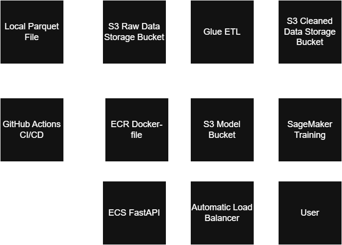

## Stock Data DevOps Pipeline

### Pipeline Diagram:

### Features:

* Infrastructure as Code: Terraform for AWS infrastructure
* CI/CD Pipeline: GitHub Actions with pre-merge checks and automatic API deployment
* Data Processing: ETL with AWS Glue for large files
* Model training: SageMaker to train time series model using Prophet
* API Service: FastAPI containerized on ECS with Application Load Balancer